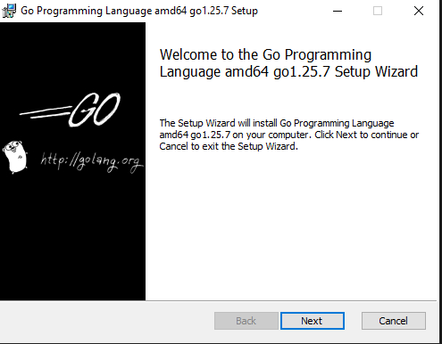
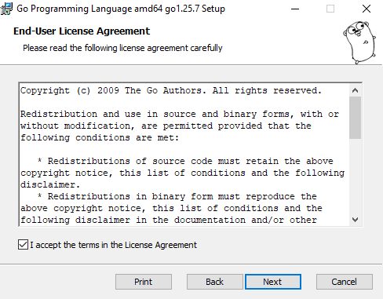
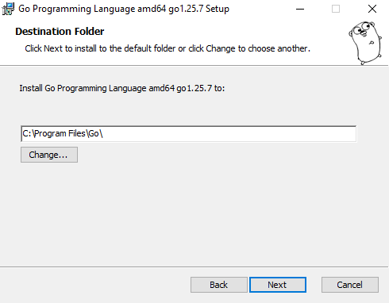
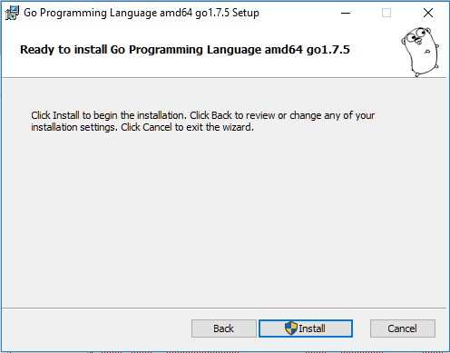
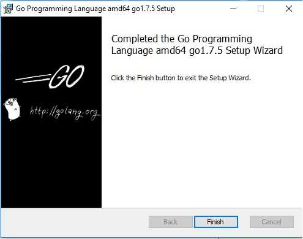

*Instalación de Golang*
1. Seleccionamos la versión de Microsoft Windows y procedemos a su descarga, luego de descargado el archivo de instalación procedemos a ejecutarlo

2. Aceptamos los términos y condiciones

3. Podemos dejar por defecto el directorio propuesto por el instalador, normalmente en C:\Go\

4. Finalmente presionamos el botón "Install":

5. Finalmente se nos informará que el proceso de instalación del lenguaje Go finalizó:
